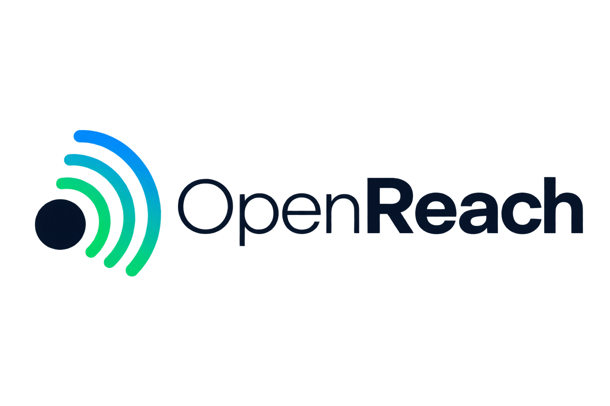

<p align="center">
  
</p>

<h1 align="center">OpenReach</h1>

<p align="center">
  <strong>面向 AI Agent 的开源 Web 访问基础设施</strong><br/>
  Search · Image Search · Read
</p>

<p align="center">
  
  
  
  
  
</p>

<p align="center">
  为 Agent 提供稳定、统一、可扩展的 Web 能力层，而不是让 Agent 直接绑定某一家搜索厂商。
</p>

---

## 项目入口

- **GitHub：** https://github.com/changluya/openreach
- **内置官网：** 服务启动后访问 `http://localhost:8080/`
- **官方文档：** `http://localhost:8080/docs/`
- **OpenReach Skill：** 官网右上角可直接下载

## OpenReach 是什么？

**OpenReach** 是一个基于 **JDK 17 + Spring Boot** 的开源 Web Access Infrastructure，面向 AI Agent、Agent Platform、Research Agent 和 HTTP Tool 场景，提供三个最基础的 Web 原语：

```text
search(query)        -> 搜索网页 / 发现信息源
image-search(query)  -> 文搜图 / 发现图片及来源页
read(url)            -> 读取网页 / 提取正文与元数据
```

核心设计目标只有一句话：

> **Agent 依赖稳定的能力接口，不依赖具体搜索厂商。**

当前版本优先解决国内开发与自托管场景：无需 Serper / Tavily API Key 即可启动，通过多 Provider 自动降级提升可用性，同时保留 SPI 扩展能力，后续可以继续接入 SearXNG、Serper、Exa、Firecrawl、Playwright 等实现。

> 当前 Bing、百度、搜狗、360、DuckDuckGo 等免费 Provider 主要基于公开搜索结果页做 best-effort 解析，不属于对应厂商商业 Search API，因此不承诺商业 SLA。Openverse 使用其公开 API。

---

## 当前工程能力

| 能力 | HTTP 接口 | 状态 | 当前实现 | 主要输出 |
|---|---|---:|---|---|
| **Web Search** | `POST /api/web/search` | ✅ | 多 Provider 自动降级 | 标题、URL、摘要、排名、来源 |
| **Image Search** | `POST /api/web/image-search` | ✅ | 多图片 Provider 自动降级 | 原图、缩略图、来源页、站点、尺寸、License |
| **Web Read** | `POST /api/web/read` | ✅ | Safe HTTP Fetch + Jsoup | 标题、正文、最终 URL、元数据、Links |
| **Health Check** | `GET /api/web/health` | ✅ | 无外部 Provider 依赖 | 部署、Skill init / doctor 连通性检查 |
| **Provider Auto Fallback** | 内部能力 | ✅ | Provider SPI + Router | 上游失败后自动切换下一渠道 |
| **URL 去重** | 内部能力 | ✅ | Search / ImageSearch 聚合层 | 去除重复结果 |
| **SSRF Protection** | Read 内部能力 | ✅ | DNS / IP / Redirect 校验 | 拦截危险 URL |
| **响应体限制** | Read 内部能力 | ✅ | max-bytes / max-chars | 避免异常大页面 |
| **Agent HTTP Plugin** | `docs/agenthub/skills/` | ✅ | 标准 HTTP Plugin JSON | Search / Image Search / Read |
| **Docker 部署** | Docker / Compose | ✅ | Runtime-only Image | amd64 / arm64 运行模型 |
| **内置官网 / Docs** | `/` · `/docs/` | ✅ | Spring Boot Static Resources | 服务启动即访问，无需独立前端 |
| **OpenReach Skill** | `skills/openreach/` | ✅ | Python Tool + CLI | Init / Doctor / Search / Image Search / Read |
| **Dynamic Browser Read** | - | ⏳ | 预留 Playwright Reader | JS 渲染页面 |
| **Commercial SERP** | - | ⏳ | 预留 Premium Provider | 稳定 SERP / Geo / 垂直搜索 |

### 当前能力边界

| 能力项 | 支持情况 | 说明 |
|---|---:|---|
| 普通网页搜索 | ✅ | 多免费 Provider，支持 `auto` 或显式指定 Provider |
| 文搜图 | ✅ | 返回图片及来源页面信息 |
| HTML / SSR 网页读取 | ✅ | 当前 Read 核心场景 |
| Provider 自动降级 | ✅ | 超时、解析失败、空结果时继续下一 Provider |
| Region 参数 | ⚠️ | 已统一参数，但不同 Provider 的支持程度不同 |
| Pagination | ❌ | v0.1.1 聚焦首屏 / Top-N |
| Freshness 统一过滤 | ❌ | 尚未形成跨 Provider 统一协议 |
| 精确 Geo | ❌ | 不承诺商业级地理定位 |
| Knowledge Graph / Shopping / Places | ❌ | 后续以垂直 Provider 扩展 |
| JavaScript 动态渲染 | ❌ | 后续接 Playwright |
| PDF / Office 读取 | ❌ | 当前 Read 聚焦 HTML |
| CAPTCHA / 强反爬绕过 | ❌ | 不建设账号池、住宅代理池、CAPTCHA 绕过体系 |
| 商业 SLA / 高 QPS SERP | ❌ | 生产场景建议接商业 Provider |

---

## 典型使用场景

OpenReach 的核心价值不是只提供一个“搜索接口”，而是把 **发现信息源 → 获取目标页面 → 提取正文内容** 串成一条适合 AI Agent 使用的 Web 访问链路。

| 场景 | Search | Read | 典型用途 |
|---|---:|---:|---|
| **企业 / 产品官网** | ✅ | ✅ | 搜索官网、产品页、解决方案、价格页、更新日志，再读取页面正文 |
| **技术文档 / 开源项目** | ✅ | ✅ | 搜索官方文档、GitHub 相关页面、博客、技术说明，并提取正文供 Agent 分析 |
| **新闻 / 行业资讯** | ✅ | ✅ | 搜索新闻、媒体报道、行业动态，继续读取原始来源页面 |
| **博客 / 专栏 / 内容站点** | ✅ | ✅ | 搜索文章并读取正文，用于知识整理、摘要、研究与引用 |
| **微信公众号公开文章** | ✅* | ✅* | 搜索公开推文链接，或直接传入公开文章 URL 读取正文 |
| **Research / Deep Research Agent** | ✅ | ✅ | 先 Search 批量发现来源，再 Read 多个页面进行汇总、对比和归纳 |
| **企业 Agent / 智能助手** | ✅ | ✅ | 给内部 Agent 增加实时互联网信息获取能力，减少对单一搜索厂商的绑定 |
| **文搜图 / 内容配图** | - | - | 通过 `image-search` 搜索图片及来源页，用于素材发现和内容生产 |

### 一个典型 Agent 调用链路

```text
用户问题
   ↓
search(query)
   ↓
发现官网 / 新闻 / 博客 / 微信公众号公开文章等候选来源
   ↓
read(url)
   ↓
提取标题 / 正文 / 元数据 / Links
   ↓
Agent 总结、问答、对比、引用或继续深度检索
```

例如，当用户询问某个产品、公司或热点事件时，Agent 可以先通过 `search` 找到 **官网、官方博客、媒体文章、微信公众号公开推文** 等信息源，再对候选 URL 调用 `read`，把页面正文交给上层模型进行总结、分析或引用。

> **微信公众号说明：** OpenReach 可以对公开可访问的微信文章 URL 尝试执行 `read`；也可以通过 Web Search 尝试发现已经被搜索引擎收录的微信公众号文章。实际可发现性取决于搜索引擎收录情况，页面能否读取则取决于微信页面当时的访问策略、反爬限制和网络环境，因此属于 best-effort 能力，不承诺所有公众号文章都能稳定搜索或读取。

> 对于需要登录、验证码、强 JavaScript 渲染或严格反爬的页面，当前 v0.1.1 的静态 HTTP Reader 可能无法完整读取，后续计划通过 Playwright / Browser Reader 扩展动态页面能力。

---

## 5 分钟快速开始

### 方式一：Docker 一键启动（推荐）

适合普通使用者。**不需要 Clone 工程，也不依赖 Compose 文件**；当 `codercl/openreach:latest` 镜像已经发布到镜像仓库后，直接执行一条命令：

```bash
docker run -d \
  --name openreach \
  --restart unless-stopped \
  -p 8080:8080 \
  codercl/openreach:latest
```

服务启动后同时内置 OpenReach 官网与文档站点：

```text
官网        http://localhost:8080/
快速启动    http://localhost:8080/docs/
接口文档    http://localhost:8080/docs/api.html
```

常用管理命令：

```bash
# 查看容器
docker ps --filter name=openreach

# 查看日志
docker logs -f openreach

# 停止并删除
docker rm -f openreach
```

如果宿主机 `8080` 已被占用，可以改成 `-p 18080:8080`，此时访问 `http://localhost:18080`。

---

### 方式二：Docker Compose（可选）

适合已经 Clone 工程、希望通过配置文件管理容器的场景：

```bash
docker compose up -d
```

```bash
docker compose ps
docker compose logs -f openreach
docker compose down
```

---

### 方式三：源码直接启动

适合开发、调试和二次开发。

环境要求：

```text
JDK 17+
Maven 3.9+
```

执行单测：

```bash
mvn clean test
```

启动：

```bash
mvn spring-boot:run
```

服务地址：

```text
http://localhost:8080
```

服务启动后同时内置 OpenReach 官网与文档站点：

```text
官网        http://localhost:8080/
快速启动    http://localhost:8080/docs/
接口文档    http://localhost:8080/docs/api.html
```

---

### 方式四：源码构建 Docker 并启动

当前 Dockerfile 是 **Runtime-only Image**：Maven 在宿主机编译并执行测试，Docker 只负责把生成的 JAR 封装成运行镜像。

```bash
./bin/quick/package.sh

docker compose -f docker-compose.build.yml up -d --build
```

如果希望先做完整本地镜像验收：

```bash
./bin/quick/docker-verify.sh
```

国内代理环境：

```bash
OPENREACH_BUILD_PROXY=http://127.0.0.1:7891 \
./bin/quick/docker-verify.sh
```

详细部署说明：

- [Docker 一键部署指南](docs/部署篇/01-Docker一键部署指南.md)
- [Docker 多架构镜像说明](docs/部署篇/02-Docker多架构镜像与一键部署核心知识点.md)
- [Docker Hub 发布指南](docs/部署篇/03-DockerHub镜像发布操作指南.md)
- [Docker 构建代理配置](docs/部署篇/04-Docker构建代理配置.md)
- [Docker 网络与发布排障](docs/部署篇/05-Docker网络与发布坑点排障.md)

---

## 快速验证 API

### Web Search

```bash
curl -X POST 'http://localhost:8080/api/web/search' \
  -H 'Content-Type: application/json' \
  -d '{
    "query": "Spring Boot AI Agent",
    "limit": 5,
    "region": "auto",
    "provider": "auto"
  }'
```

### Image Search

```bash
curl -X POST 'http://localhost:8080/api/web/image-search' \
  -H 'Content-Type: application/json' \
  -d '{
    "query": "杭州西湖夜景",
    "limit": 8,
    "region": "auto",
    "provider": "auto"
  }'
```

### Web Read

```bash
curl -X POST 'http://localhost:8080/api/web/read' \
  -H 'Content-Type: application/json' \
  -d '{
    "url": "https://spring.io/projects/spring-boot/",
    "maxChars": 20000
  }'
```

更多示例：

- [接口测试与 Curl 示例](docs/接口测试与Curl示例.md)
- [AgentHub 接口文档](docs/agenthub/接口文档/OpenReach接口文档.md)

服务启动后也可以直接执行：

```bash
./bin/quick/smoke-test.sh
```


---

## OpenReach Skill / Python CLI

OpenReach 内置一个可独立下载的 Python Skill。服务部署后，官网右上角点击 **「下载 Skill」** 即可获取：

```text
http://<你的 OpenReach 服务器>:8080/downloads/openreach-skill.zip
```

项目源码中对应目录：

```text
skills/openreach/
├── SKILL.md                     # Agent 使用说明 + ChatGPT-like Search SOP
├── README.md
├── config.example.json
├── scripts/
│   └── openreach.py             # Python Tool + CLI
└── tests/
    └── test_openreach.py
```

Skill **无需第三方 Python 依赖**。下载解压后，只需要提供一次 OpenReach 服务器 IP：

```bash
python3 scripts/openreach.py init 192.168.1.20
```

默认组成 `http://192.168.1.20:8080`。`init` 会先调用 `GET /api/web/health` 执行前置连通性检查，成功后才将地址写入当前 Skill 的 `config.json`：

```json
{
  "base_url": "http://192.168.1.20:8080"
}
```

之后所有 Tool 自动读取配置：

```bash
python3 scripts/openreach.py doctor
python3 scripts/openreach.py search "AI Agent" --region auto --provider auto --limit 5
python3 scripts/openreach.py image-search "杭州西湖" --region auto --provider auto --limit 8
python3 scripts/openreach.py read "https://spring.io/projects/spring-boot/" --max-chars 20000
```

Python Tool 也可以直接调用：

```python
from skills.openreach import doctor, search, image_search, read

doctor()
results = search("OpenReach AI Agent", region="auto", provider="auto", limit=5)
```

`search` / `image-search` 的 `region` 默认均为 **`auto`**，省略时等价于 `auto`；为了让 Agent 调用链和日志更清楚，README、官网与 Skill 示例均显式展示该参数。明确地域时可以传 `CN`、`JP`、`US` 等，由 Provider best-effort 映射。

Skill 内还提供基于项目 ChatGPT Search 调研抽象出的 Agentic Search SOP：**Query Planning → Search → Source Selection → Read → Evidence Check → 再搜索/再读取 → Cross-source Verification → Citation**。

详细说明见：[skills/openreach/SKILL.md](skills/openreach/SKILL.md)

## Provider 支持

### Web Search

默认 `provider=auto` 路由：

```text
Bing 中国 → 百度 → 搜狗 → 360 搜索 → DuckDuckGo
```

| 渠道 | Provider Key | 接入形式 | API Key | 当前定位 |
|---|---|---|---:|---|
| **Bing 中国** | `bing` | HTML SERP | ❌ | 默认第一路 |
| **百度** | `baidu` | HTML SERP | ❌ | 中文核心 fallback |
| **搜狗** | `sogou` | HTML SERP | ❌ | 国内 fallback |
| **360 搜索** | `so360` | HTML SERP | ❌ | 国内 fallback |
| **DuckDuckGo** | `duckduckgo` | HTML Search | ❌ | 最后兜底 |

### Image Search

默认 `provider=auto` 路由：

```text
Bing Images → 百度图片 → 搜狗图片 → Openverse
```

| 渠道 | Provider Key | 接入形式 | 正式 API | 当前定位 |
|---|---|---|---:|---|
| **Bing Images** | `bing` | 图片搜索结果解析 | ❌ | 默认第一路 |
| **百度图片** | `baidu` | `acjson` + warmup | ❌ | 中文图片核心 fallback |
| **搜狗图片** | `sogou` | 页面 State 解析 | ❌ | 国内图片补充 |
| **Openverse** | `openverse` | 官方公开 API | ✅ | 开放许可图片与 License 元数据 |

---

## 核心架构

```text
                         AI Agent / Agent Platform
                                   │
                    ┌──────────────┼──────────────┐
                    │              │              │
                    ▼              ▼              ▼
              Web Search      Image Search      Web Read
                    │              │              │
                    ▼              ▼              ▼
             SearchService  ImageSearchService WebReadService
                    │              │              │
                    ▼              ▼              ▼
            SearchProvider  ImageSearchProvider PageReader
                  SPI              SPI              │
                    │              │                ▼
          ┌─────────┼──────┐  ┌────┼─────┐   UrlSafetyGuard
          │         │      │  │    │     │          │
        Bing      Baidu  ... Bing Baidu  ...        ▼
                                                   SafeHttpFetcher
                                                        │
                                                        ▼
                                                Jsoup / Extractor
```

项目通过 Provider SPI 隔离具体上游：

```text
Agent / API
    ↓
统一能力接口
    ↓
Provider Router
    ↓
免费 Provider / 自托管 Provider / 商业 Provider
```

因此业务侧不需要因为更换搜索厂商而重写 Agent Tool 协议。

---

## 工程目录

```text
openreach/
├── src/main/java/
│   └── io/github/changlu/openreach/
│       ├── search/                 # Web Search
│       ├── imagesearch/            # Image Search
│       ├── read/                   # Web Read
│       ├── security/               # URL / SSRF 安全
│       ├── config/                 # 配置
│       └── web/                    # HTTP Controller
├── src/test/java/                  # 单元测试
├── src/main/resources/static/      # 内置官网与在线文档
│   ├── index.html                  # http://localhost:8080/
│   └── docs/                       # /docs/ 与 /docs/api.html
├── skills/openreach/               # OpenReach Skill / Python CLI
├── docs/
│   ├── 核心市场调研分析/
│   ├── 核心搜索接口设计/
│   ├── 部署篇/
│   ├── agenthub/
│   └── 设计文档/产物/logo.png      # README 使用的 Logo
├── bin/quick/                      # 测试 / 打包 / 构建 / 发布 / Smoke
├── Dockerfile
├── docker-compose.yml
├── docker-compose.build.yml
└── pom.xml
```

---

## 快捷命令

| 场景 | 命令 |
|---|---|
| 全量单测 | `./bin/quick/check-project.sh` |
| Maven 打包 | `./bin/quick/package.sh` |
| 本地 Docker 构建 | `./bin/quick/docker-build.sh` |
| 本地镜像启动验收 | `./bin/quick/docker-verify.sh` |
| 公网接口 Smoke Test | `./bin/quick/smoke-test.sh` |
| 一键发布 Docker Hub | `./bin/quick/release.sh` |
| Docker 一键启动 | `docker run -d --name openreach --restart unless-stopped -p 8080:8080 codercl/openreach:latest` |
| Docker Compose 启动（可选） | `docker compose up -d` |
| Docker Compose 停止 | `docker compose down` |

更多说明：[bin/quick/README.md](bin/quick/README.md)

---

## 文档导航

### 核心搜索接口设计

- [WebSearch 核心流程设计](docs/核心搜索接口设计/01-websearch核心流程设计.md)
- [ImageSearch 核心流程设计](docs/核心搜索接口设计/02-imagesearch核心流程设计.md)
- [Read 核心流程设计](docs/核心搜索接口设计/03-read核心流程设计.md)

### 核心市场调研

- [ChatGPT 搜索实现与 WebSearch 能力分析](docs/核心市场调研分析/01-ChatGPT搜索实现与WebSearch能力分析.md)
- [Serper.dev 能力深度分析拆解](docs/核心市场调研分析/02-Serper.dev能力深度分析拆解.md)
- [早期第一版调研方案](docs/核心市场调研分析/早期第一版调研方案.md)

### 工程、测试与能力说明

- [初版本设计方案](docs/初版本设计方案.md)
- [当前工程能力与渠道支持](docs/当前工程能力与渠道支持.md)
- [核心测试与验收](docs/核心测试与验收.md)
- [接口测试与 Curl 示例](docs/接口测试与Curl示例.md)

### 部署与发布

- [Docker 一键部署指南](docs/部署篇/01-Docker一键部署指南.md)
- [Docker 多架构镜像与一键部署核心知识点](docs/部署篇/02-Docker多架构镜像与一键部署核心知识点.md)
- [Docker Hub 镜像发布操作指南](docs/部署篇/03-DockerHub镜像发布操作指南.md)
- [Docker 构建代理配置](docs/部署篇/04-Docker构建代理配置.md)
- [Docker 网络与发布坑点排障](docs/部署篇/05-Docker网络与发布坑点排障.md)

---


## AgentHub / HTTP Plugin

项目已经提供标准 HTTP Plugin JSON：

```text
docs/agenthub/skills/openreach-http-plugin.json
```

三个核心能力可以直接封装为 Agent Tool：

```text
search
image-search
read
```

适合作为 AgentHub、Research Agent、Coding Agent、企业内部智能体平台的 Web 基础能力层。

---

## Roadmap

```text
v0.1.1
├── Web Search                     ✅
├── Image Search                   ✅
├── Web Read                       ✅
├── Multi-Provider Fallback        ✅
├── URL Deduplication              ✅
├── SSRF Protection                ✅
├── Agent HTTP Plugin              ✅
└── Docker Deployment              ✅

Next
├── Playwright Dynamic Read
├── SearXNG Provider
├── Serper Premium Provider
├── Search Quality Gate
├── News Search
├── Places / Maps Search
├── Rerank / Source Quality
└── Citation / Research Pipeline
```

---

## 关于免费搜索 Provider

OpenReach 的目标不是自研 Google SERP 反爬平台。

当前免费 Provider 通过多渠道容错降低单一上游 DOM 改版、限流、网络出口变化带来的影响，但仍属于 **best-effort** 能力。

如果后续生产业务需要稳定 Google SERP、精确 Geo、Places / Maps / Shopping、高 QPS 或商业 SLA，建议通过 `SearchProvider` SPI 接入商业 Provider，而不是在 OpenReach 中建设账号池、Cookie 池、住宅代理池或 CAPTCHA 绕过体系。

---

## 交流群

扫码加入 OpenReach 交流群，一起交流 Agent 联网能力、多 Provider 路由与开源共建：

<div align="center">
  
</div>

---

## License

当前工程尚未附加正式 `LICENSE`。

在正式公开发布到 GitHub 前，建议明确选择 **MIT**、**Apache-2.0** 或其他符合项目目标的开源许可证。

---

## English

**OpenReach** is an open-source Web access infrastructure for AI Agents, built with **JDK 17 + Spring Boot**.

It exposes three stable primitives:

```text
search(query)
image-search(query)
read(url)
```

> **Agents depend on stable capabilities, not on a specific search vendor.**

Quick start with Docker:

```bash
docker run -d --name openreach --restart unless-stopped -p 8080:8080 codercl/openreach:latest
```

For local development:

```bash
mvn clean test
mvn spring-boot:run
```

See the Chinese sections above for the full capability matrix, provider support, API examples, architecture and deployment documentation.
