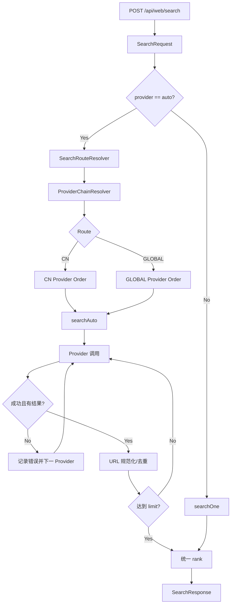

# WebSearch 核心流程设计

> 接口：`POST /api/web/search`
> 当前版本：**OpenReach v0.1.3**

---

## 1. 接口目标

WebSearch 给 Agent 提供统一网页发现能力，上层只依赖：

```text
query + limit + region + provider + timeRange
```

不绑定某个搜索厂商。

请求：

```json
{
  "query":"latest Java AI Agent frameworks",
  "limit":5,
  "region":"US",
  "provider":"auto",
  "timeRange":"month"
}
```

响应：

```json
{
  "provider":"auto",
  "query":"latest Java AI Agent frameworks",
  "region":"US",
  "timeRange":"month",
  "count":5,
  "latencyMs":320,
  "items":[
    {
      "rank":1,
      "title":"...",
      "url":"https://...",
      "snippet":"...",
      "source":"brave"
    }
  ]
}
```

---

## 2. v0.1.2 核心变化

v1.0.1：

```text
provider=auto
  -> provider-order
  -> bing -> baidu -> sogou -> so360 -> duckduckgo
```

v0.1.2：

```text
provider=auto
  -> region
  -> SearchRouteResolver
  -> ProviderChainResolver
     ├─ CN     -> CN Provider Chain
     └─ GLOBAL -> GLOBAL Provider Chain
```

`region` 不再只是 Provider Hint，而是先决定核心路由。

---

## 3. 参数语义

| 字段 | 必填 | 说明 |
|---|---:|---|
| `query` | ✅ | 搜索文本 |
| `limit` | ❌ | 1~20，默认 10 |
| `region` | ❌ | 默认 `auto`；CN aliases 走国内，其余显式区域走 GLOBAL |
| `provider` | ❌ | 默认 `auto`；也可显式 `bing/baidu/sogou/so360/duckduckgo/brave` |

### `region=auto`

由：

```yaml
openreach.web.routing.default-route: cn
```

决定，默认仍为 CN，兼容 v1.0.1。

### 显式 Provider

显式 Provider 优先于 Route Chain：

```json
{"query":"OpenAI","region":"CN","provider":"brave"}
```

直接 Brave，不做 Auto fallback。

---

## 4. 路由流程



---

## 5. CN / GLOBAL 默认链

### CN

默认配置保持兼容式写法：

```yaml
provider-order: [bing, baidu, sogou, so360, duckduckgo] # v1.0.1 字段
cn-provider-order: [] # 空时继承 provider-order
```

因此默认**有效 CN Chain**仍为：`bing → baidu → sogou → so360 → duckduckgo`。如需独立调整 CN 链，再显式填写 `cn-provider-order`。

### GLOBAL

```yaml
global-provider-order:
  - brave
  - duckduckgo
  - bing
```

旧字段继续存在：

```yaml
provider-order:
  - bing
  - baidu
  - sogou
  - so360
  - duckduckgo
```

如果旧部署没有配置 `cn-provider-order`，或保持为空，CN Route 仍使用旧 `provider-order`；项目内置默认值也是空列表，确保外部旧配置不会被遮蔽。

---

## 6. SearchRouteResolver

当前内部只定义：

```java
public enum SearchRoute {
    CN,
    GLOBAL
}
```

核心规则：

```text
CN / zh-CN / zh_CN / cn-zh / zh-Hans-CN / china -> CN
其他显式 region -> GLOBAL
auto / blank -> default-route
```

这样以后扩：

```text
JP / EU / CUSTOM
```

只需要扩 Route Policy，不必给 API 增加 `route` 字段。


### ProviderChainResolver

Route 解析完成后统一由 `ProviderChainResolver` 选择 Web Provider Order：

```text
CN     -> cn-provider-order；为空时继承 provider-order
GLOBAL -> global-provider-order
```

`SearchService` 不再读取 CN/GLOBAL 配置字段，只负责执行已经解析好的 Chain、fallback、聚合与去重。这样未来新增 JP/EU 等 Route 时，地区分支不会重新散落回 Service。

---

## 7. Provider 设计

SPI 不变：

```java
public interface SearchProvider {
    String name();
    List<SearchItem> search(String query, int limit, String region);
}
```

### Bing

```text
CN     -> cn.bing.com
GLOBAL -> www.bing.com
```

复用同一个 Parser。

### Brave

v0.1.2 新增：

```text
BraveSearchProvider
```

只走无需 Key 的公开 Web Interface：

```text
https://search.brave.com/search?q=...&source=web
```

解析 HTML `snippet` 结果块。

### DuckDuckGo

v0.1.2 强化为 HTML no-JS POST Form：

```text
POST https://html.duckduckgo.com/html/
q=...
b=
kl=...
```

并补：

```text
Accept-Language
Referer
Sec-Fetch-Mode
Cookie kl
bot challenge detection
```

一旦识别 challenge，Provider fail-fast，Auto Chain 继续下一路，不做验证码绕过。

---

## 8. timeRange 时间范围设计

对外字段统一为 `timeRange`：`any/day/week/month/year`。兼容常见 `d/w/m/y`、`pd/pw/pm/py`、`qdr:*` alias，进入 Service 后先规范化为 `SearchTimeRange`。

```text
SearchRequest.timeRange
  -> SearchTimeRange.parse
  -> ANY / DAY / WEEK / MONTH / YEAR
  -> SearchProvider.supportsTimeRange(timeRange)
  -> Provider-specific mapping
```

当前真实映射：

```text
Baidu Web:  day/week/month/year -> gpc=stf=<start>,<end>|stftype=1 + timefactor=21/22/23/24
Bing Web:   day/week/month      -> filters=ex1:"ez1/ez2/ez3"
             year               -> 未验证稳定免费 Web 参数，主动判定 unsupported
Brave:      day=pd week=pw month=pm year=py
DuckDuckGo: day=d  week=w  month=m  year=y
```

设计原则：不支持时间过滤的 Provider 绝不能静默忽略。`provider=auto` 时跳过，显式 Provider 时直接返回 `BAD_REQUEST`。原三参数 `SearchProvider.search(...)` 继续保留，第三方 v1.0.1 Provider 无需修改；时间能力通过 default 方法增量扩展。

---

## 9. 聚合策略

Auto Chain：

1. 按 Route 的 Provider 顺序调用；
2. 单路异常只记录，不中断整体；
3. 按 canonical URL 去重；
4. 达到 `limit` 提前停止；
5. 最终统一 rank；
6. 所有 Provider 都失败才抛 `UPSTREAM_ERROR`。

显式 Provider 不做 fallback，便于诊断单渠道。

---

## 10. 为什么不做 Query 语言自动路由

错误做法：

```text
中文 query -> CN
英文 query -> GLOBAL
```

原因：

```text
"OpenAI 最新进展" + region=US
```

用户明确希望海外搜索环境，不能因为中文 Query 改回国内。

因此 Route 只由明确的 `region` / default-route 决定。

---

## 11. 测试重点

必须覆盖：

```text
CN alias -> CN Chain
US/JP/SG/GLOBAL/wt-wt -> GLOBAL Chain
auto -> 默认 CN
配置 default-route=global
legacy provider-order 兼容
显式 provider 不 fallback
单 Provider 失败继续下一路
URL 去重
limit/rank
Brave DOM Fixture
DDG Challenge Fixture
SearchTimeRange alias / invalid value
timeRange 下跳过 unsupported Provider
显式 unsupported Provider fail-fast
Baidu / Bing / Brave / DDG 时间参数映射
Bing Parser 回归
```

公网 Smoke 与离线 JUnit 分离。
