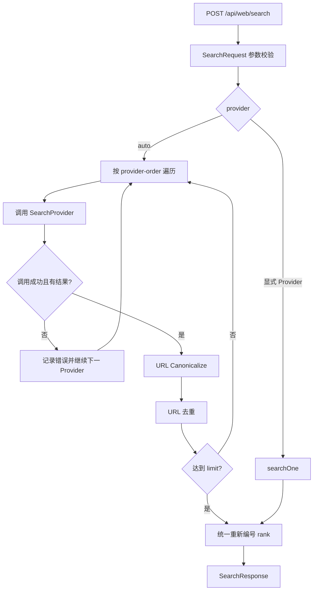

# WebSearch 核心流程设计

> 对应接口：`POST /api/web/search`  
> 当前版本：OpenReach v0.1.1  
> 核心目标：给 Agent 提供一个统一、轻量、可容错、可替换 Provider 的网页发现能力。

---

## 1. 能力定位

`websearch` 只解决一个问题：

> **根据查询词发现值得继续读取的网页。**

它不负责：

- 打开网页并读取正文；
- LLM 总结；
- Citation 生成；
- Deep Research 规划；
- 浏览器交互。

这些能力由 `read` 或 Agent 上层组合完成。

推荐调用链：

```text
Agent
  │
  ├── search(query)
  │       ↓
  │   SearchResult[]
  │       ↓
  ├── read(url)
  │       ↓
  │   Clean Content
  │
  └── LLM / Citation / Research
```

---

## 2. 当前接口

```http
POST /api/web/search
Content-Type: application/json
```

请求：

```json
{
  "query": "杭州 AI Agent 开源框架",
  "limit": 5,
  "region": "auto",
  "provider": "auto"
}
```

字段：

| 字段 | 必填 | 当前含义 |
|---|---:|---|
| `query` | ✅ | 搜索关键词 |
| `limit` | ❌ | 1~20，默认 10 |
| `region` | ❌ | 默认 `auto`，Provider 尽力映射，不承诺精确 Geo |
| `provider` | ❌ | `auto/bing/baidu/sogou/so360/duckduckgo` |

响应：

```json
{
  "provider": "auto",
  "query": "杭州 AI Agent 开源框架",
  "region": "auto",
  "count": 5,
  "latencyMs": 320,
  "items": [
    {
      "rank": 1,
      "title": "...",
      "url": "https://example.com/page",
      "snippet": "...",
      "source": "bing"
    }
  ]
}
```

---

## 3. 当前 Java 结构

```text
WebCapabilityController
        │
        ▼
   SearchService
        │
        ▼
 SearchProvider SPI
        │
 ┌──────┼────────┬────────┬───────────┐
 ▼      ▼        ▼        ▼           ▼
Bing   Baidu    Sogou    360     DuckDuckGo
```

核心类：

```text
io.github.changlu.openreach.web.WebCapabilityController
io.github.changlu.openreach.search.SearchService
io.github.changlu.openreach.search.SearchProvider
io.github.changlu.openreach.search.provider.*
io.github.changlu.openreach.search.dto.*
```

Provider SPI：

```java
public interface SearchProvider {
    String name();
    List<SearchItem> search(String query, int limit, String region);
}
```

设计原则：

> Controller / Agent 只依赖统一 Search DTO，不感知上游搜索引擎 HTML、参数和 Parser。

---

## 4. Auto Provider 核心流程

默认顺序：

```yaml
provider-order:
  - bing
  - baidu
  - sogou
  - so360
  - duckduckgo
```

执行流程：



### 当前 Auto 的语义

Auto 不是“随机选择一路”，而是：

```text
按优先级调用
+
失败继续下一路
+
结果不足继续补充
+
跨 Provider URL 去重
+
统一 rank
```

因此即使第一路出现：

```text
Timeout
403 / 429
DOM 改版
Parser 为空
```

也不会立刻让接口整体失败。

---

## 5. URL 去重策略

`SearchService` 当前对 URL 做基础 canonicalization：

```text
scheme 小写
host 小写
移除 path 尾部 /
保留 query
```

然后使用 `LinkedHashMap`：

```text
首次出现的 URL 保留
后续重复 URL 丢弃
Provider 原始顺序尽可能保留
```

V1 不做激进 URL 归一化，例如暂不统一移除：

```text
utm_source
utm_campaign
spm
from
tracking id
```

原因是过度规则化可能错误合并业务上不同的 URL。

后续可增加独立：

```text
UrlCanonicalizer
TrackingParameterPolicy
```

---

## 6. Provider 选择原则

当前免费链路针对国内运行环境优先：

| 顺序 | Provider | 设计定位 |
|---:|---|---|
| 1 | Bing 中国 | 第一默认通用搜索源 |
| 2 | 百度 | 中文搜索核心 fallback |
| 3 | 搜狗 | 国内补充搜索源 |
| 4 | 360 | 国内补充搜索源 |
| 5 | DuckDuckGo | 海外兜底 |

这几路当前属于 **best-effort 免费 Provider**，并不是搜索引擎官方商业 API。

因此系统的稳定性策略不是追求“某一路永久不变”，而是：

> **SPI + 多 Provider 容错 + 单测 Parser Fixture + 后续 Premium Fallback。**

---

## 7. 失败模型

### 显式指定 Provider

例如：

```json
{
  "query": "Spring Boot",
  "provider": "baidu"
}
```

若 Baidu 没有可解析结果：

```text
直接返回 UPSTREAM_ERROR
```

用途：

- Provider 定向测试；
- 渠道健康诊断；
- 对比搜索质量。

### Auto 模式

单路失败：

```text
记录错误
→ 下一 Provider
```

全部失败：

```text
502 UPSTREAM_ERROR
```

错误信息会汇总各 Provider 的紧凑失败原因，方便本地排查。

---

## 8. 当前能力边界

当前支持：

```text
网页发现
Title
URL
Snippet
Rank
Source
Limit
基础 Region
多 Provider fallback
URL 去重
```

当前不承诺：

```text
Google SERP 一致性
精确 Geo
Knowledge Graph
实时 News SLA
Places / Maps
Shopping
Scholar
Pagination
统一 Freshness
高 QPS SLA
```

这些能力不应该通过不断污染 `SearchRequest` 来堆叠。

未来更建议形成独立能力：

```text
web-search
image-search
news-search
place-search
shopping-search
...
```

---

## 9. 后续接 Serper 的扩展方式

当前接口已经适合直接增加：

```java
@Component
public class SerperSearchProvider implements SearchProvider {
    @Override
    public String name() {
        return "serper";
    }

    @Override
    public List<SearchItem> search(String query, int limit, String region) {
        // 调 Serper API
        // organic -> SearchItem
    }
}
```

理想 V2：

```text
SearchService
      │
      ▼
 Search Router
      │
 ┌────┴─────────┐
 ▼              ▼
FREE          PREMIUM
SearXNG/       Serper
Current Free
Providers
```

进一步可以从“只有失败才 fallback”升级为：

```text
Free Search
   ↓
Quality Gate
   ├── Good -> return
   └── Bad  -> Serper
```

Quality Gate 可逐步考虑：

```text
结果数量
独立 Domain 数
重复率
Provider 健康度
TopK 相关度
查询意图
```

---

## 10. 与 Agent 的建议契约

Agent 只需要理解：

```text
search(query) -> candidates
```

不要让 Agent 感知：

```text
Bing selector
百度 pn 参数
搜狗 DOM
360 页面结构
DuckDuckGo HTML
Serper API key
```

上游细节全部属于 Provider 层。

推荐 Agent 使用方式：

```text
简单事实：
search -> read Top1~2

普通调研：
search -> read Top3~5

复杂研究：
多 Query search -> merge -> read -> rerank -> synthesis
```

---

## 11. V1 验收关注点

WebSearch 必须覆盖：

- Provider Parser Fixture 单测；
- Auto fallback；
- 显式 Provider；
- URL 去重；
- limit；
- 全 Provider 失败；
- 参数校验；
- 本地公网 smoke test。

正式验收 Gate 见：

```text
docs/核心测试与验收.md
```

---

## 12. 一句话总结

> **WebSearch 是“网页发现层”，核心价值不是绑定某个免费搜索页面，而是通过统一 `SearchProvider` SPI 把 Provider 变化隔离在 Agent 之外，并通过 Auto fallback 为后续 SearXNG / Serper 商业升级保留稳定接口。**
