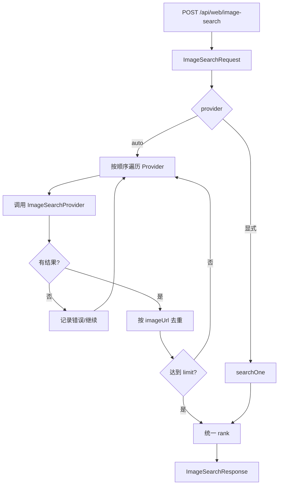

# ImageSearch 核心流程设计

> 对应接口：`POST /api/web/image-search`  
> 当前版本：OpenReach v0.1.0  
> 核心目标：给 Agent 提供独立的“文本发现图片”能力，并保留图片来源页面和版权元数据。

---

## 1. 为什么 ImageSearch 必须独立

图片搜索不是普通 Web Search 加一个 `type=image` 就结束。

图片结果天然拥有不同的数据结构：

```text
原图 URL
缩略图 URL
来源网页
来源站点
宽度 / 高度
格式
License
License URL
```

因此当前设计将它作为第三个独立基础原语：

```text
search(query)        -> 网页候选
image-search(query)  -> 图片候选
read(url)            -> 网页正文
```

而不是：

```text
search(query, type=image/news/maps/shopping/...)
```

这样可以避免一个 Search DTO 被不同垂直 SERP 持续污染。

---

## 2. 当前接口

```http
POST /api/web/image-search
Content-Type: application/json
```

请求：

```json
{
  "query": "杭州西湖夜景",
  "limit": 8,
  "region": "CN",
  "provider": "auto"
}
```

字段：

| 字段 | 必填 | 当前含义 |
|---|---:|---|
| `query` | ✅ | 图片搜索文本 |
| `limit` | ❌ | 1~30，默认 10 |
| `region` | ❌ | 默认 CN，Provider best-effort |
| `provider` | ❌ | `auto/bing/baidu/sogou/openverse` |

响应：

```json
{
  "provider": "auto",
  "query": "杭州西湖夜景",
  "region": "CN",
  "count": 8,
  "latencyMs": 560,
  "items": [
    {
      "rank": 1,
      "title": "杭州西湖夜景",
      "imageUrl": "https://.../image.jpg",
      "thumbnailUrl": "https://.../thumb.jpg",
      "sourcePageUrl": "https://example.com/article",
      "provider": "bing",
      "source": "example.com",
      "domain": "example.com",
      "width": 1920,
      "height": 1080,
      "imageFormat": "jpg",
      "license": null,
      "licenseUrl": null
    }
  ]
}
```

---

## 3. 当前 Java 结构

```text
WebCapabilityController
        │
        ▼
 ImageSearchService
        │
        ▼
ImageSearchProvider SPI
        │
 ┌──────┼──────────┬────────────┐
 ▼      ▼          ▼            ▼
Bing   Baidu      Sogou      Openverse
Images Images     Images        API
```

核心类：

```text
io.github.changlu.openreach.imagesearch.ImageSearchService
io.github.changlu.openreach.imagesearch.ImageSearchProvider
io.github.changlu.openreach.imagesearch.provider.*
io.github.changlu.openreach.imagesearch.dto.*
```

SPI：

```java
public interface ImageSearchProvider {
    String name();
    List<ImageSearchItem> search(String query, int limit, String region);
}
```

---

## 4. 为什么返回 `sourcePageUrl`

这是当前设计最重要的字段之一。

只返回：

```text
imageUrl
```

Agent 只能看到一张图片，无法回答：

```text
图片来自哪里？
图片对应什么文章？
这个图片描述是否可信？
是否可以形成引用？
```

因此结果必须尽可能保留：

```text
imageUrl
      │
      └── sourcePageUrl
                │
                ▼
              read()
                │
                ▼
       网页上下文 / 来源证据
```

推荐 Agent 链路：

```text
image-search("杭州西湖夜景")
        ↓
ImageSearchItem
        ↓
选择候选图片
        ↓
read(sourcePageUrl)
        ↓
理解图片所在上下文
```

这也是未来做图片 Citation、图片来源解释、公众号配图等能力的基础。

---

## 5. Auto Provider 核心流程

当前顺序：

```yaml
provider-order:
  - bing
  - baidu
  - sogou
  - openverse
```

流程：



当前 Auto 的目标不是把四路结果全部抓满，而是：

> **优先拿到足量、可用的图片候选，同时允许上游单路失败。**

---

## 6. 当前四路 Provider 的职责

### 6.1 Bing Images

定位：

```text
通用图片搜索第一路
```

优点：

- 通用覆盖较广；
- 国内 Bing 入口；
- 常能获得原图、缩略图、来源页和宽高。

风险：

- 当前属于结果页 best-effort 解析；
- 非商业 SLA。

### 6.2 百度图片

定位：

```text
中文图片核心 fallback
```

当前流程：

```text
访问 image.baidu.com warmup
        ↓
获取 Cookie
        ↓
/search/acjson
        ↓
解析 data[]
```

价值：

- 国内中文图片覆盖重要；
- 常有图片 URL、来源页、尺寸等字段。

风险：

- Cookie / JSON Schema 可变化；
- 可能受 anti-spider 影响。

### 6.3 搜狗图片

定位：

```text
国内补充图片源
```

当前从图片页面的 `window.__INITIAL_STATE__` 中提取结果。实现上**不使用正则直接截取嵌套 JSON**，而是先定位 State 赋值，再按 `{}` 深度扫描，并识别字符串与转义字符，最后交给 Jackson 3 `JsonMapper` 解析。

```text
HTML
 ↓
定位 window.__INITIAL_STATE__
 ↓
寻找首个 {
 ↓
括号深度扫描（忽略字符串内的 {}）
 ↓
完整 State JSON
 ↓
JsonMapper
 ↓
searchList.searchList
 ↓
ImageSearchItem
```

这样可以避免两类问题：

- Java Regex 中 `{` 转义错误导致 Provider 类初始化失败；
- `.*?` 面对嵌套对象时提前截断，产生不完整 JSON。

风险：

- 页面内部 State Schema 不是稳定公开 API；
- State 字段名变化仍需要通过 fixture / Smoke Test 发现并适配。

### 6.4 Openverse

定位与前三者不同：

```text
开放授权图片补充源
```

价值：

- 正式公开 API；
- 匿名请求无需 API Key；
- 部分结果包含 License / License URL。

因此 Openverse 更适合：

```text
需要关注授权信息的配图候选
```

而不是完全替代通用 Web 图片搜索。

---

## 7. 图片结果去重

当前使用：

```text
imageUrl.trim()
```

作为基本去重 Key。

这样实现简单，但存在局限：

```text
同一图片的 CDN resize URL 可能被视为不同图片
不同图片 URL 参数可能指向同一底图
```

V1 不下载图片，因此无法做：

```text
pHash
aHash
dHash
CLIP embedding 去重
```

后续如果增加 Image Cache / Fetcher，可以独立增加：

```text
ImageDeduplicator
├── URL normalize
├── Content hash
└── Perceptual hash
```

不要把这些逻辑塞进 Provider Parser。

---

## 8. 图片版权边界

当前接口的语义是：

> **发现图片，不代表获得图片使用授权。**

因此：

```text
license == null
```

不能被解释为：

```text
可商用
无版权
公共领域
```

只有上游明确提供 License 时才透传。

尤其通用搜索 Provider 返回的图片，应继续保留：

```text
sourcePageUrl
source/domain
```

由上层 Agent / 用户进一步确认来源和使用权。

Openverse 结果虽然提供 License，也建议保留 attribution / source 信息，而不是只使用图片直链。

---

## 9. 当前不属于 ImageSearch 的能力

以下能力应该独立设计，不要塞进当前接口：

```text
以图搜图 Reverse Image Search
OCR
图片理解 / VLM
图片生成
图片下载代理
图片二进制缓存
图片编辑
图片版权自动判决
图片向量检索
```

未来能力关系可以是：

```text
image-search     文本发现互联网图片
image-read       下载/读取图片内容（未来）
image-understand VLM 理解（模型层）
image-reverse    以图搜图（独立 Provider）
```

---

## 10. 后续 Serper Images 扩展

未来增加：

```java
SerperImageSearchProvider implements ImageSearchProvider
```

只需要把商业 API 字段转换为统一：

```text
title
imageUrl
thumbnailUrl
sourcePageUrl
source/domain
width/height
```

Agent 接口完全不变。

建议未来路由：

```text
ImageSearchService
       │
       ▼
ImageSearchRouter
       │
 ┌─────┴─────────┐
 ▼               ▼
FREE           PREMIUM
Bing/Baidu/     Serper Images
Sogou/Openverse
```

Premium 触发条件可包括：

```text
免费结果为空
图片直链有效率低
来源页缺失过多
查询需要稳定 Google Images SERP
用户明确选择 premium
```

---

## 11. 当前安全与资源边界

当前 `image-search`：

```text
只发现并返回 URL
不代理图片二进制
不自动下载所有原图
```

这是刻意设计。

优点：

- 避免图片下载带宽放大；
- 避免未知文件直接进入服务；
- 避免图片 CDN SSRF / 大文件风险扩展到 V1；
- 接口延迟更低。

如果未来增加图片下载能力，应单独使用 Safe Image Fetcher，并重新设计：

```text
Content-Type
Max Bytes
DNS / Redirect SSRF
Dimension Limit
Decode Bomb
Cache
```

---

## 12. V1 验收关注点

ImageSearch 测试应覆盖：

- Bing Parser fixture；
- 百度 Parser fixture；
- 搜狗 Parser fixture；
- Openverse JSON fixture；
- Auto fallback；
- imageUrl 去重；
- limit；
- provider 显式选择；
- 全部失败；
- 结果关键字段完整性。

正式 Gate：

```text
mvn clean test
```

全部测试通过后才允许验收。

---

## 13. 一句话总结

> **ImageSearch 是独立的图片 Discovery 原语：V1 重点不是下载图片，而是稳定返回“图片 + 缩略图 + 来源页 + 来源站点 + 可得元数据”，从而让 Agent 可以继续使用 `read(sourcePageUrl)` 建立图片上下文和来源证据。**
