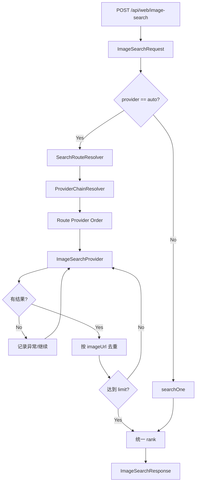

# ImageSearch 核心流程设计

> 接口：`POST /api/web/image-search`
> 当前版本：**OpenReach v0.1.2**

---

## 1. 为什么 ImageSearch 独立

图片结果有独立数据模型：

```text
imageUrl
thumbnailUrl
sourcePageUrl
provider/source/domain
width/height
imageFormat
license/licenseUrl
```

因此保持：

```text
search(query)
image-search(query)
read(url)
```

三个独立 Agent 原语。

---

## 2. 请求

```json
{
  "query":"Golden Gate Bridge",
  "limit":8,
  "region":"US",
  "provider":"auto"
}
```

`provider` 当前支持：

```text
auto
bing
baidu
sogou
openverse
wikimedia
```

---

## 3. v0.1.2 Route-aware Image Search

```text
region
  ↓
SearchRouteResolver
  ↓
ProviderChainResolver
  ├─ CN
  │   bing -> baidu -> sogou -> openverse
  │
  └─ GLOBAL
      bing -> openverse -> wikimedia
```

Image Search 与 Web Search 共用同一套 `SearchRouteResolver + ProviderChainResolver`：前者统一地域规则，后者统一 Route → 能力链配置，避免两个 Service 各自维护地区分支。

---

## 4. Auto 核心流程



---

## 5. CN Route

```yaml
provider-order: [bing, baidu, sogou, openverse] # v1.0.1 字段
cn-provider-order: [] # 空时继承 provider-order
```

因此默认有效 CN Image Chain 仍是 `bing → baidu → sogou → openverse`，保持 v1.0.1 国内图片能力。

---

## 6. GLOBAL Route

```yaml
global-provider-order:
  - bing
  - openverse
  - wikimedia
```

### Bing Global Images

同一 `BingImageSearchProvider`：

```text
CN     -> cn.bing.com/images/async
GLOBAL -> www.bing.com/images/async
```

复用已有 `a.iusc[m]` Parser。

### Openverse

继续作为稳定的开放许可图片源：

```text
url
thumbnail
foreign_landing_url
width/height
license/license_url
```

无需 API Key 即可使用匿名请求。

### Wikimedia Commons

v0.1.2 新增：

```text
WikimediaImageSearchProvider
```

公开 Action API：

```text
action=query
format=json
formatversion=2
generator=search
gsrnamespace=6
prop=imageinfo
iiprop=url|size|mime|extmetadata
```

映射：

```text
imageinfo.url            -> imageUrl
thumburl                 -> thumbnailUrl
descriptionurl           -> sourcePageUrl
width/height             -> width/height
mime                     -> imageFormat
LicenseShortName.value   -> license
LicenseUrl.value         -> licenseUrl
```

---

## 7. 为什么 v0.1.2 不默认接 Brave Images

Brave Images 虽无需 Key，但当前 Web Interface 的图片数据主要来自内嵌 Svelte/JS 状态，不像 Brave Web 可以直接依赖清晰 HTML Result Block。

对于默认基础设施：

```text
可维护性 > Provider 数量
```

当前三路 GLOBAL Image Chain 已覆盖：

```text
通用图片：Bing
开放许可：Openverse
百科/公共领域：Wikimedia
```

因此 Brave Images 留在后续观察池。

---

## 8. 可下载图片质量门禁

Provider 返回的 `imageUrl` 只是候选，不能直接视为可用图片。v0.1.2 在 Service 聚合层强制增加：

```text
候选 over-fetch
  -> SecureImageDownloadVerifier
  -> UrlSafetyGuard（公网 HTTP/HTTPS + 80/443）
  -> Redirect 每跳复检
  -> GET + Range 小前缀探测
  -> 2xx + 非 HTML/XML/SVG
  -> JPEG/PNG/GIF/WebP/BMP/TIFF/ICO/AVIF/HEIC 字节签名
  -> downloadable items
```

默认候选倍率 3、最多 60、单次探测 4s、最多 3 次重定向、并发 6。某 Provider 有候选但验证后为空时，`auto` 继续下一 Provider；显式 Provider 则返回上游错误。

这保证响应中的 `imageUrl` 在**响应生成时**可被 OpenReach 直接取得真实图片字节。由于公网链接可能随后过期，不能承诺永久可下载。

---

## 9. sourcePageUrl 的意义

图片搜索不仅要返回图片，还要保留来源：

```text
image-search
  -> imageUrl
  -> sourcePageUrl
  -> read(sourcePageUrl)
  -> 来源上下文/引用证据
```

这是 Agent 做图片引用、事实核验、内容配图的重要基础。

---

## 10. 兼容配置

旧配置：

```yaml
provider-order:
  - bing
  - baidu
  - sogou
  - openverse
```

仍可作为 CN Route fallback 配置使用。

v0.1.2 默认采用兼容配置：

```yaml
provider-order: [bing, baidu, sogou, openverse]
cn-provider-order: [] # 继承旧字段；需要独立 CN 顺序时再显式填写
global-provider-order: [bing, openverse, wikimedia]
```

---

## 11. 测试重点

```text
CN / GLOBAL Chain 选择
auto 默认 CN
legacy provider-order
单路失败 fallback
imageUrl 去重
rank/limit
Bing iusc metadata
Openverse JSON
Wikimedia imageinfo
Wikimedia license/licenseUrl
缺失 imageinfo / license 容错
无效/403/HTML/伪图片过滤
首 Provider 不可下载时继续 fallback
显式 Provider 无可下载结果时 fail-fast
常见图片字节签名识别
图片探测 SSRF / localhost 拒绝
candidate over-fetch 上限
```

公网真实页面变化由 Smoke Test + Bad Case Fixture 闭环，不把公网请求写进 JUnit。
