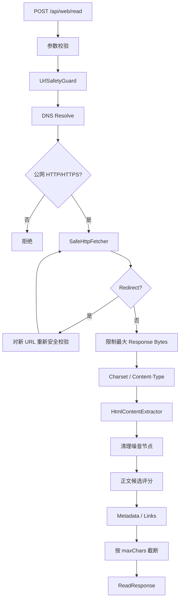

# Read 核心流程设计

> 对应接口：`POST /api/web/read`
> 当前版本：OpenReach v0.1.3
> 核心目标：安全读取指定公网 URL，并把 HTML 转换为适合 Agent 消费的正文、元数据和链接。

---

## 1. 能力定位

`read(url)` 回答：

> **这个 URL 页面实际讲了什么？**

它不负责搜索 URL。

与 WebSearch 的边界：

```text
search(query)
     ↓
发现候选 URL
     ↓
read(url)
     ↓
正文 / Metadata / Links
```

与 ImageSearch 的组合：

```text
image-search(query)
       ↓
sourcePageUrl
       ↓
read(sourcePageUrl)
       ↓
理解图片所在页面上下文
```

---

## 2. 当前接口

```http
POST /api/web/read
Content-Type: application/json
```

请求：

```json
{
  "url": "https://spring.io/projects/spring-boot/",
  "maxChars": 20000
}
```

字段：

| 字段 | 必填 | 当前含义 |
|---|---:|---|
| `url` | ✅ | 仅允许 HTTP/HTTPS 公网 URL |
| `maxChars` | ❌ | 1000~200000；默认配置 50000 |

响应：

```json
{
  "url": "https://spring.io/projects/spring-boot/",
  "finalUrl": "https://spring.io/projects/spring-boot/",
  "title": "Spring Boot",
  "content": "...正文...",
  "contentType": "text/html; charset=utf-8",
  "reader": "jsoup",
  "truncated": false,
  "latencyMs": 800,
  "metadata": {
    "description": "..."
  },
  "links": [
    "https://spring.io/..."
  ]
}
```

---

## 3. 当前 Java 结构

```text
WebCapabilityController
        │
        ▼
   WebReadService
        │
        ▼
     PageReader
        │
        ▼
  JsoupPageReader
        │
   ┌────┴───────────────┐
   ▼                    ▼
SafeHttpFetcher   HtmlContentExtractor
   │                    │
   ▼                    ▼
UrlSafetyGuard      Clean Content
```

核心类：

```text
io.github.changlu.openreach.read.WebReadService
io.github.changlu.openreach.read.PageReader
io.github.changlu.openreach.read.reader.JsoupPageReader
io.github.changlu.openreach.read.reader.SafeHttpFetcher
io.github.changlu.openreach.read.reader.HtmlContentExtractor
io.github.changlu.openreach.security.UrlSafetyGuard
```

SPI：

```java
public interface PageReader {
    String name();
    ReadResponse read(ReadRequest request);
}
```

当前只有：

```text
JsoupPageReader
```

但接口允许后续增加：

```text
PlaywrightPageReader
PdfPageReader
Crawl4AIPageReader
FirecrawlPageReader
```

---

## 4. Read 完整核心流程



这里最关键的是两个设计：

1. **安全 Fetch 与正文提取分开**；
2. **不是看到 `<main>` / `<article>` 就直接返回，而是做正文候选评分。**

---

## 5. 为什么不能直接 `Jsoup.connect(url)`

Agent 可控 URL 天然存在 SSRF 风险。

如果直接：

```java
Jsoup.connect(userInputUrl).get();
```

可能访问：

```text
localhost
127.0.0.1
10.x.x.x
172.16~31.x.x
192.168.x.x
169.254.x.x
云 Metadata
内部服务 DNS
```

因此当前实现把网络读取单独放到：

```text
SafeHttpFetcher
```

并在请求前使用：

```text
UrlSafetyGuard
```

---

## 6. SSRF 核心策略

当前需要拒绝：

```text
非 http / https scheme
loopback
site-local/private IP
link-local
multicast
unspecified/local addresses
localhost 类地址
```

重要的是：

> **不仅初始 URL 要检查，每一次 Redirect 后的新 URL 也要重新检查。**

否则攻击者可以：

```text
公网 URL
  ↓ 302
http://127.0.0.1:xxxx
```

绕过首次检查。

当前还限制最大 redirect 数，防止无限跳转。

---

## 7. Response Body 限制

Read 是一个面向 Agent 的工具，不是通用下载器。

因此必须限制：

```text
maxBytes
maxChars
```

当前配置默认：

```yaml
read:
  # 兼容旧配置；新版本拆分连接与单次请求总超时
  timeout-ms: 10000
  connect-timeout-ms: 7000
  request-timeout-ms: 15000
  max-attempts: 2
  retry-backoff-ms: 200
  max-bytes: 5242880
  max-chars: 50000
  max-redirects: 5
```

目标：

```text
避免超大响应撑爆内存
避免 Agent Context 无意义膨胀
避免下载大型二进制文件
```

对于 `HTTP connect timed out`、连接重置等幂等 GET 网络 IO，默认允许 **1 次有界重试（总 2 次）**。对明确属于瞬时网关/源站故障的 `408/425/500/502/503/504/520~524`，同样复用 `max-attempts` 做有界 GET 重试；`401/403/412/429` 不自动重试，避免把访问控制、前置条件或限流误当成瞬时故障。每次尝试都会在 upstream 日志记录 `attempt/maxAttempts`。

---

## 8. 失败语义与调用方边界（v0.1.3 增强）

Read 当前明确区分三类失败：

```text
调用方目标错误
  -> 私网 / localhost / 非 80/443 / 二进制附件
  -> 400 BAD_REQUEST（Skill 会先本地 fail-fast）

目标站访问策略
  -> 403 / 412 等
  -> 502 UPSTREAM_ERROR
  -> failureType=HTTP_403/HTTP_412
  -> upstreamStatus=403/412
  -> retryable=false

瞬时上游故障
  -> 500/502/503/504/520~524 等
  -> GET 有界重试后仍失败
  -> 502 UPSTREAM_ERROR + retryable=true
```

核心原则：

1. **不要通过放开 SSRF 去兼容内网附件 URL**。OpenReach Read 是公网网页读取器，不是内部 HTTP 代理。
2. **403/412 不对同一 URL 机械重试**。Agent 应换公开来源，或退回 Search 结果并明确正文未成功读取。
3. **521 等 5xx 只做服务端有界重试**，避免 Agent 与服务端叠加重试形成请求风暴。
4. Read GET 增加无 Cookie/无 Authorization 的浏览器导航兼容 Header，用于提高普通公开网页兼容性，但不绕过登录、验证码、Cookie 会话或 WAF 挑战。

---

## 9. 正文提取为什么使用“候选评分”

早期最简单策略：

```text
article
  ↓没有
main
  ↓没有
body
```

在现代官网上很容易失败。

例如页面可能包含：

```text
<main>
  一个很小的促销卡片
</main>

真正正文在另外的大型容器
```

如果简单选择 `<main>`，最终可能只提取一句营销文案。

因此当前 `HtmlContentExtractor` 改为：

```text
扫描候选容器
    ↓
计算正文质量特征
    ↓
选择更可能是真正文的块
```

关注维度包括：

```text
文本长度
段落密度
链接密度
标签类型
正文结构
噪音节点
```

目标不是实现通用浏览器阅读模式的全部算法，而是显著优于：

```text
article > main > body
```

这种硬编码优先级。

---

## 10. HTML 清洗边界

正文提取前会去除典型噪音：

```text
script
style
noscript
nav
header/footer
aside
form
svg/canvas
以及明显非正文节点
```

然后提取：

```text
title
content
metadata
links
```

V1 的目标是 **LLM-ready text**，不是 1:1 还原网页视觉样式。

因此当前不追求：

```text
CSS
复杂 Markdown table 完美还原
网页 layout
JS 组件状态
动画
交互
```

---

## 11. Charset 处理

国内网页仍可能出现：

```text
UTF-8
GBK
GB2312
GB18030
```

当前实现会结合：

```text
Content-Type header
HTML meta charset
```

做基础识别，并处理部分中文编码兼容。

但是 V1 不承诺覆盖所有历史网站的异常编码情况。

---

## 12. 当前 Read 的核心输出为什么包含 Links

除了正文外，当前还返回部分页面链接。

意义：

```text
read(官网首页)
     ↓
links
     ↓
Agent 发现 docs / pricing / github / download
```

这让 Agent 可以形成轻量的页面内导航能力。

但 V1 不等于递归 Crawler：

```text
read 不会自动无限跟踪所有 links
```

是否继续读取由 Agent 决定。

---

## 13. 当前不支持的网页类型

### JS-only / SPA

Jsoup 只能读取 HTTP 返回的 HTML，不能执行 JavaScript。

对于：

```text
React/Vue SPA shell
浏览器执行后才出现正文
Infinite Scroll
点击后加载内容
```

当前可能读不到完整内容。

V1.5 建议：

```text
JsoupPageReader
      ↓
Read Quality Gate
      ├── Good -> return
      └── Bad  -> PlaywrightPageReader
```

### PDF

PDF 应独立：

```text
PdfPageReader
```

不要强行塞进 HTML Extractor。

### 登录/强 Cookie 页面

V1 不做登录 Session、账号池或 Cookie farming。

---

## 14. 后续 Reader Router 设计

当前：

```text
WebReadService
      ↓
JsoupPageReader
```

后续：

```text
WebReadService
      ↓
 ReaderRouter
      │
 ┌────┼──────────┬───────────┐
 ▼    ▼          ▼           ▼
Jsoup Playwright PDF     Firecrawl/
                        Crawl4AI
```

推荐路由：

```text
普通 HTML
  -> Jsoup

JS 动态页面
  -> Playwright

PDF
  -> PDF Reader

强网页数据抽取/复杂交互
  -> Premium/External Reader
```

Agent 的 `read(url)` 接口保持不变。

---

## 15. Read Quality Gate 建议

未来增加 Playwright 时，不建议所有请求直接启动浏览器。

可以先用 Jsoup，并根据：

```text
正文字符数
正文/HTML 比例
页面是否只有 root/app shell
script 比例
明显 enable javascript 文案
标题存在但正文近乎为空
```

判断是否 fallback。

这样可以保持：

```text
大部分普通网页低成本
+
少数动态网页浏览器兜底
```

---

## 16. V1 验收关注点

Read 测试必须覆盖：

```text
正文候选评分
噪音清理
title / metadata
中文编码
maxChars 截断
private IP 拒绝
loopback 拒绝
非法 scheme 拒绝
redirect 安全
```

公网 Smoke Test 建议至少包括：

```text
普通静态文章
现代官网
中文网页
带 redirect 页面
```

公网网络测试只能作为 smoke，不能替代可重复的单元测试。

正式 Gate：

```text
mvn clean test
```

---

## 17. 一句话总结

> **Read 是安全网页读取层：V1 用 `SafeHttpFetcher + UrlSafetyGuard + Jsoup + 正文候选评分` 把指定公网 URL 转换为 Agent 可消费内容；未来 Playwright、PDF、Firecrawl 等都应通过 `PageReader/ReaderRouter` 扩展，而不改变 Agent 的 `read(url)` 契约。**
